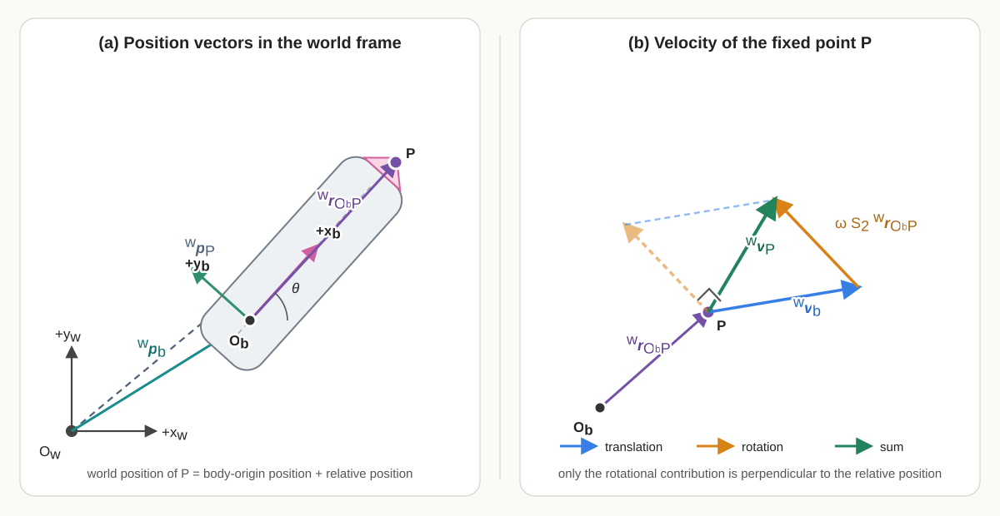

# Planar Rigid-Body Motion: $SE(2)$ and Twists

## Why this chapter matters

The differential-drive pose $\mathbf q=[x\;y\;\theta]^\mathsf T$ is convenient for storing three coordinates, but it does not by itself expose how rigid motions compose, how the same motion is expressed in different frames, or why constant body velocity produces the exact curved-motion update derived previously. This chapter develops the planar rigid-motion structure needed to answer those questions. It begins by distinguishing a pose from its coordinates and representing a planar pose by a homogeneous transformation in the special Euclidean group $SE(2)$.

## Prerequisites and assumptions

The reader should understand matrices and matrix multiplication from the [linear algebra foundations chapter](01_linear_algebra_foundations.qmd), coordinate frames and rotation matrices from the [geometry and coordinate frames chapter](02_geometry_and_coordinate_frames.qmd), and planar pose notation from the [differential-drive kinematics chapter](03_kinematics_and_numerical_integration.qmd).

All frames in this learning block are right-handed planar frames embedded in three-dimensional physical space with a common vertical axis. Frame $\{w\}$ is the fixed world frame and frame $\{b\}$ is attached rigidly to the robot body. Distances are measured in metres and angles in radians.

## 1. Pose coordinates and rigid transformations

### 1.1 A pose is a relative geometric relationship

A planar rigid body's **pose** specifies both its position and its orientation relative to a reference frame. The word *relative* is essential: saying that a robot is at position $(2,1)$ with heading $\pi/2$ is incomplete until the reference frame and sign convention are known.

Let $O_w$ and $O_b$ denote the origins of frames $\{w\}$ and $\{b\}$. The position of $O_b$ relative to $O_w$, expressed in world-frame coordinates, is

$$
{}^{w}\mathbf p_b
=
\begin{bmatrix}
x\\
y
\end{bmatrix}
\in\mathbb R^2,
$$

where $x$ and $y$ are measured in metres. The orientation of frame $\{b\}$ relative to frame $\{w\}$ is represented by the rotation matrix $\mathbf R_{wb}(\theta)\in\mathbb R^{2\times2}$:

$$
\mathbf R_{wb}(\theta)
=
\begin{bmatrix}
\cos\theta&-\sin\theta\\
\sin\theta&\cos\theta
\end{bmatrix}.
$$

The subscript order $wb$ means that $\mathbf R_{wb}$ maps vector coordinates from frame $\{b\}$ to frame $\{w\}$. The pose of $\{b\}$ relative to $\{w\}$ can therefore be described by the pair

$$
\left(\mathbf R_{wb},{}^{w}\mathbf p_b\right).
$$

This pair separates orientation from position. A homogeneous transformation will combine them into one matrix without confusing their different roles.

### 1.2 Planar rotations and $SO(2)$

The set of valid planar rotation matrices is called the **special orthogonal group in two dimensions**, written $SO(2)$ and defined by

$$
SO(2)
\mathrel{:=}
\left\{
\mathbf R\in\mathbb R^{2\times2}
\;\middle|\;
\mathbf R^\mathsf T\mathbf R=\mathbf I_2,
\quad
\det(\mathbf R)=1
\right\}.
$$

The word *orthogonal* refers to $\mathbf R^\mathsf T\mathbf R=\mathbf I_2$, which means that the columns form an orthonormal basis and that $\mathbf R^{-1}=\mathbf R^\mathsf T$. The word *special* adds the condition $\det(\mathbf R)=1$, excluding reflections whose determinant is $-1$.

The word *group* means that the set is equipped with an operation satisfying four properties: closure, associativity, an identity element, and an inverse for every element. For $SO(2)$, the operation is matrix multiplication.

**Closure** means that multiplying any two elements of $SO(2)$ produces another element of $SO(2)$. If $\mathbf R(\alpha)$ and $\mathbf R(\beta)$ represent planar rotations through angles $\alpha$ and $\beta$, then

$$
\mathbf R(\alpha)\mathbf R(\beta)
=
\mathbf R(\alpha+\beta)
\in SO(2).
$$

Geometrically, performing one planar rotation and then another still produces a valid planar rotation; it does not introduce scaling, shear, or reflection.

**Associativity** means that the placement of parentheses does not change the result of composing three rotations:

$$
\left(\mathbf R_1\mathbf R_2\right)\mathbf R_3
=
\mathbf R_1\left(\mathbf R_2\mathbf R_3\right).
$$

Associativity changes only the grouping, not the order, of the matrices. It should not be confused with commutativity, which would permit the order to be exchanged. The identity element is $\mathbf I_2$, and every $\mathbf R\in SO(2)$ has the inverse $\mathbf R^\mathsf T\in SO(2)$.

Every planar rotation matrix can be written as $\mathbf R(\theta)$ for some $\theta\in\mathbb R$. The angle is not unique because

$$
\mathbf R(\theta+2\pi n)=\mathbf R(\theta),
\qquad n\in\mathbb Z,
$$

where $\mathbb Z$ is the set of integers. Thus, $\theta$ is a **coordinate** used to describe an orientation, while $\mathbf R(\theta)$ represents the **orientation** itself. Angles that differ by an integer multiple of $2\pi$ describe the same element of $SO(2)$.

### 1.3 Transforming a point by rotation and translation

Let $P$ be a geometric point fixed to the robot. Its position relative to $O_b$, expressed in body-frame coordinates, is ${}^{b}\mathbf p_P\in\mathbb R^2$ and is measured in metres. Its world-frame position is obtained by first rotating its body-frame displacement and then adding the world-frame position of the body origin:

$$
\boxed{
{}^{w}\mathbf p_P
=
\mathbf R_{wb}\,{}^{b}\mathbf p_P
+
{}^{w}\mathbf p_b
}.
$$

This equation follows by tracing the geometric displacement from $O_w$ to $P$. First travel from $O_w$ to $O_b$ by ${}^{w}\mathbf p_b$. Then travel from $O_b$ to $P$ by ${}^{b}\mathbf p_P$, but rotate that second displacement with $\mathbf R_{wb}$ so that both terms are expressed in world-frame coordinates before adding them.

A free vector, such as a displacement or velocity vector, has direction and magnitude but no fixed origin. It therefore changes coordinates using rotation alone:

$$
{}^{w}\mathbf v
=
\mathbf R_{wb}\,{}^{b}\mathbf v.
$$

Translation appears in the point equation because a point is located relative to a frame origin. It does not appear in the free-vector equation because a free vector is not attached to an origin.

### 1.4 Homogeneous transformations and $SE(2)$

The point mapping in Section 1.3 contains both a matrix multiplication and a vector addition. Homogeneous coordinates package these two operations into one matrix multiplication. Define the homogeneous coordinate column of point $P$ by appending a $1$:

$$
{}^{b}\overline{\mathbf p}_P
\mathrel{:=}
\begin{bmatrix}
{}^{b}\mathbf p_P\\
1
\end{bmatrix}
\in\mathbb R^3.
$$

The overline identifies a homogeneous coordinate representation, not a different geometric point. Define the **homogeneous transformation** from frame $\{b\}$ to frame $\{w\}$ by

$$
\boxed{
\mathbf T_{wb}
\mathrel{:=}
\begin{bmatrix}
\mathbf R_{wb}&{}^{w}\mathbf p_b\\
\mathbf 0_2^\mathsf T&1
\end{bmatrix}
}
\in\mathbb R^{3\times3},
$$

where $\mathbf 0_2=[0\;0]^\mathsf T\in\mathbb R^2$. The subscript order means that $\mathbf T_{wb}$ maps homogeneous point coordinates from frame $\{b\}$ to frame $\{w\}$:

$$
\begin{aligned}
{}^{w}\overline{\mathbf p}_P
&=
\mathbf T_{wb}\,{}^{b}\overline{\mathbf p}_P\\
&=
\begin{bmatrix}
\mathbf R_{wb}&{}^{w}\mathbf p_b\\
\mathbf 0_2^\mathsf T&1
\end{bmatrix}
\begin{bmatrix}
{}^{b}\mathbf p_P\\
1
\end{bmatrix}\\
&=
\begin{bmatrix}
\mathbf R_{wb}\,{}^{b}\mathbf p_P+{}^{w}\mathbf p_b\\
1
\end{bmatrix}.
\end{aligned}
$$

The upper two entries reproduce the point-transformation equation. Appending $1$ causes the translation column to contribute to the result. Thus, $\mathbf T_{wb}$ rotates the point’s body-frame displacement into the world frame and then adds the world position of the body origin.

Using ${}^{w}\mathbf p_b=[x\;y]^\mathsf T$ and $\mathbf R_{wb}=\mathbf R_{wb}(\theta)$ gives the component form

$$
\mathbf T_{wb}
=
\begin{bmatrix}
\cos\theta&-\sin\theta&x\\
\sin\theta&\cos\theta&y\\
0&0&1
\end{bmatrix}.
$$

The rotation block is dimensionless, while the first two entries of the translation column have units of metres. The final row is an algebraic device that permits rotation and translation to be applied by one matrix multiplication; it does not represent another physical spatial dimension.

To preserve the rotation-only mapping for a free vector, define its homogeneous representation by appending a $0$:

$$
{}^{b}\overline{\mathbf v}
\mathrel{:=}
\begin{bmatrix}
{}^{b}\mathbf v\\
0
\end{bmatrix}.
$$

Then

$$
\mathbf T_{wb}
\begin{bmatrix}
{}^{b}\mathbf v\\
0
\end{bmatrix}
=
\begin{bmatrix}
\mathbf R_{wb}\,{}^{b}\mathbf v\\
0
\end{bmatrix}.
$$

Appending $0$ prevents the translation column from contributing. This algebraic distinction encodes the geometric fact that changing a point's reference frame requires rotation and translation, whereas changing the coordinates of a free vector requires only rotation.

The set of all planar homogeneous transformations is the **special Euclidean group in two dimensions**:

$$
SE(2)
\mathrel{:=}
\left\{
\begin{bmatrix}
\mathbf R&\mathbf p\\
\mathbf 0_2^\mathsf T&1
\end{bmatrix}
\;\middle|\;
\mathbf R\in SO(2),
\quad
\mathbf p\in\mathbb R^2
\right\}.
$$

Here, *Euclidean* indicates rigid motions that preserve Euclidean distances and angles. Matrix multiplication is the group operation, the $3\times3$ identity $\mathbf I_3$ is the identity motion, and every element has an inverse that reverses the coordinate mapping. Section 1.6 derives that inverse explicitly.

### 1.5 Composing transformations

Introduce a third frame $\{c\}$. Let $\mathbf T_{ab}\in SE(2)$ map coordinates from frame $\{b\}$ to frame $\{a\}$, and let $\mathbf T_{bc}\in SE(2)$ map coordinates from frame $\{c\}$ to frame $\{b\}$. Applying the two mappings to a point gives

$$
{}^{a}\overline{\mathbf p}_P
=
\mathbf T_{ab}
\left(
\mathbf T_{bc}\,{}^{c}\overline{\mathbf p}_P
\right)
=
\left(
\mathbf T_{ab}\mathbf T_{bc}
\right)
{}^{c}\overline{\mathbf p}_P.
$$

Therefore, the transform that maps directly from frame $\{c\}$ to frame $\{a\}$ is

$$
\boxed{
\mathbf T_{ac}
=
\mathbf T_{ab}\mathbf T_{bc}
}.
$$

The adjacent frame label $b$ identifies the intermediate frame. Expanding the block multiplication gives

$$
\begin{aligned}
\mathbf T_{ab}\mathbf T_{bc}
&=
\begin{bmatrix}
\mathbf R_{ab}&{}^{a}\mathbf p_b\\
\mathbf 0_2^\mathsf T&1
\end{bmatrix}
\begin{bmatrix}
\mathbf R_{bc}&{}^{b}\mathbf p_c\\
\mathbf 0_2^\mathsf T&1
\end{bmatrix}\\
&=
\begin{bmatrix}
\mathbf R_{ab}\mathbf R_{bc}&
\mathbf R_{ab}\,{}^{b}\mathbf p_c+{}^{a}\mathbf p_b\\
\mathbf 0_2^\mathsf T&1
\end{bmatrix}.
\end{aligned}
$$

Consequently,

$$
\boxed{
\mathbf R_{ac}=\mathbf R_{ab}\mathbf R_{bc},
\qquad
{}^{a}\mathbf p_c
=
\mathbf R_{ab}\,{}^{b}\mathbf p_c
+
{}^{a}\mathbf p_b
}.
$$

The translation vectors cannot be added directly until they are expressed in the same frame. The product first rotates ${}^{b}\mathbf p_c$ into frame $\{a\}$ and only then adds ${}^{a}\mathbf p_b$.

### 1.6 Inverting a transformation

The inverse transform $\mathbf T_{ba}=\mathbf T_{ab}^{-1}$ must undo both the translation and the rotation. Starting from the point mapping

$$
{}^{a}\mathbf p_P
=
\mathbf R_{ab}\,{}^{b}\mathbf p_P
+
{}^{a}\mathbf p_b,
$$

subtract ${}^{a}\mathbf p_b$ and premultiply by $\mathbf R_{ab}^{-1}=\mathbf R_{ab}^\mathsf T$:

$$
{}^{b}\mathbf p_P
=
\mathbf R_{ab}^\mathsf T
\left(
{}^{a}\mathbf p_P-{}^{a}\mathbf p_b
\right).
$$

Distributing the rotation gives

$$
{}^{b}\mathbf p_P
=
\mathbf R_{ab}^\mathsf T{}^{a}\mathbf p_P
-
\mathbf R_{ab}^\mathsf T{}^{a}\mathbf p_b.
$$

Therefore,

$$
\boxed{
\mathbf T_{ab}^{-1}
=
\mathbf T_{ba}
=
\begin{bmatrix}
\mathbf R_{ab}^\mathsf T&
-\mathbf R_{ab}^\mathsf T{}^{a}\mathbf p_b\\
\mathbf 0_2^\mathsf T&1
\end{bmatrix}
}.
$$

The inverse translation is not generally $-{}^{a}\mathbf p_b$ because that column is expressed in frame $\{a\}$. It must first be negated and then expressed in frame $\{b\}$ by $\mathbf R_{ab}^\mathsf T$.

### 1.7 Pose coordinates versus the pose itself

The familiar column

$$
\mathbf q
=
\begin{bmatrix}
x\\y\\\theta
\end{bmatrix}
$$

has the following meaning:

- $x\in\mathbb R$ is the $x_w$-coordinate of the body origin $O_b$, expressed in the world frame and measured in metres;
- $y\in\mathbb R$ is the $y_w$-coordinate of $O_b$, expressed in the world frame and measured in metres; and
- $\theta\in\mathbb R$ is the counter-clockwise orientation of body frame $\{b\}$ relative to world frame $\{w\}$, measured in radians.

Therefore, the position of the body origin relative to the world origin, expressed in world-frame coordinates, is

$$
{}^w\mathbf p_b
=
\begin{bmatrix}
x\\y
\end{bmatrix}.
$$

The notation ${}^w\mathbf p_b$ means “the position of the body origin $O_b$, expressed in world-frame coordinates.” Thus, $\mathbf q$ is a coordinate description of the pose of frame $\{b\}$ relative to frame $\{w\}$. The same pose can be represented by $\mathbf T_{wb}\in SE(2)$:

$$
\boxed{
\mathbf q
=
\begin{bmatrix}
x\\y\\\theta
\end{bmatrix}
\quad\longmapsto\quad
\mathbf T_{wb}(\mathbf q)
=
\begin{bmatrix}
\cos\theta&-\sin\theta&x\\
\sin\theta&\cos\theta&y\\
0&0&1
\end{bmatrix}
}.
$$

The coordinate column is useful for storage, plotting, and differential equations, but it is not an ordinary geometric vector. Its components represent different physical quantities, $\theta$ and $\theta+2\pi n$ represent the same orientation, and componentwise addition does not in general reproduce rigid-motion composition. Transformations should be composed by matrix multiplication with explicit frame labels.

### 1.8 Worked example

Suppose the body origin is at

$$
{}^{w}\mathbf p_b
=
\begin{bmatrix}
2\\1
\end{bmatrix}
\mathrm m
$$

and the body heading is $\theta=\pi/2\,\mathrm{rad}$. A point $P$ fixed one metre along the body $+x_b$-axis has body-frame coordinates

$$
{}^{b}\mathbf p_P
=
\begin{bmatrix}
1\\0
\end{bmatrix}
\mathrm m.
$$

The rotation and homogeneous transformation are

$$
\mathbf R_{wb}\left(\frac{\pi}{2}\right)
=
\begin{bmatrix}
0&-1\\
1&0
\end{bmatrix},
\qquad
\mathbf T_{wb}
=
\begin{bmatrix}
0&-1&2\\
1&0&1\\
0&0&1
\end{bmatrix}.
$$

Applying the transform gives

$$
\begin{aligned}
{}^{w}\overline{\mathbf p}_P
&=
\mathbf T_{wb}{}^{b}\overline{\mathbf p}_P\\
&=
\begin{bmatrix}
0&-1&2\\
1&0&1\\
0&0&1
\end{bmatrix}
\begin{bmatrix}
1\\0\\1
\end{bmatrix}\\
&=
\begin{bmatrix}
2\\2\\1
\end{bmatrix}.
\end{aligned}
$$

Thus, ${}^{w}\mathbf p_P=[2\;2]^\mathsf T\,\mathrm m$. The one-metre body-frame displacement is rotated into the world $+y_w$-direction and then added to the body origin at $[2\;1]^\mathsf T\,\mathrm m$.

## Quick test A: pose and $SE(2)$

1. What geometric information is contained in the pair $(\mathbf R_{wb},{}^{w}\mathbf p_b)$, and what does the subscript order $wb$ mean?
2. Define $SO(2)$. What do its orthogonality and determinant conditions exclude or guarantee?
3. Why do $\theta$ and $\theta+2\pi$ describe the same orientation?
4. Starting from the block definitions of $\mathbf T_{ab}$ and $\mathbf T_{bc}$, derive the translation column of $\mathbf T_{ac}=\mathbf T_{ab}\mathbf T_{bc}$.
5. Why is the inverse translation $-\mathbf R_{ab}^\mathsf T{}^{a}\mathbf p_b$ rather than simply $-{}^{a}\mathbf p_b$?
6. A body frame has world position $[3\;2]^\mathsf T\,\mathrm m$ and heading $-\pi/2\,\mathrm{rad}$. Find the world coordinates of a point whose body coordinates are $[0.5\;0]^\mathsf T\,\mathrm m$.
7. Explain why $\mathbf q_1+\mathbf q_2$ is not generally the composition of the two poses represented by $\mathbf q_1$ and $\mathbf q_2$.
8. Name two transformations that cannot be represented by an element of $SE(2)$ and explain why.

### Answers and hints

1. $\mathbf R_{wb}$ describes the orientation of frame $\{b\}$ relative to frame $\{w\}$, while ${}^{w}\mathbf p_b$ locates $O_b$ relative to $O_w$ using world coordinates. The order $wb$ means that the rotation maps coordinate columns from $\{b\}$ to $\{w\}$.
2. $SO(2)=\{\mathbf R\in\mathbb R^{2\times2}\mid\mathbf R^\mathsf T\mathbf R=\mathbf I_2,\det\mathbf R=1\}$. Orthogonality preserves lengths and angles and gives $\mathbf R^{-1}=\mathbf R^\mathsf T$; determinant $+1$ preserves orientation and excludes reflections.
3. Sine and cosine are $2\pi$-periodic, so every entry of $\mathbf R(\theta+2\pi)$ equals the corresponding entry of $\mathbf R(\theta)$.
4. Block multiplication gives ${}^{a}\mathbf p_c=\mathbf R_{ab}{}^{b}\mathbf p_c+{}^{a}\mathbf p_b$. The first term rotates the $b$-frame translation into frame $\{a\}$ before the two translations are added.
5. The reversed displacement must be expressed in frame $\{b\}$, whereas ${}^{a}\mathbf p_b$ is expressed in frame $\{a\}$. Premultiplication by $\mathbf R_{ab}^\mathsf T$ performs the necessary coordinate change.
6. $\mathbf R_{wb}(-\pi/2)[0.5\;0]^\mathsf T=[0\;-0.5]^\mathsf T\,\mathrm m$, so ${}^{w}\mathbf p_P=[3\;1.5]^\mathsf T\,\mathrm m$.
7. Rigid-motion composition must account for the frame in which each translation is expressed and for the order of rotations and translations. Componentwise addition does neither, and angular coordinates are periodic.
8. Examples include nonuniform scaling, shear, and elastic deformation. They do not preserve every distance and angle, so they are not rigid motions and do not belong to $SE(2)$.

## 2. Passive coordinate changes and active rigid motions

The same numerical rotation or homogeneous-transformation matrix can appear in different geometric questions. Correct interpretation requires identifying what remains fixed, what changes, and the frame in which every coordinate column is expressed.

### 2.1 Passive coordinate change

A **passive coordinate change** keeps the geometric point, vector, or rigid body unchanged and changes only the coordinate frame used to describe it. The word *passive* indicates that nothing physically moves.

For example, let the geometric point $P$ remain fixed while its coordinates are changed from frame $\{b\}$ to frame $\{w\}$. The passive point-coordinate transformation is

$$
{}^{w}\overline{\mathbf p}_P
=
\mathbf T_{wb}\,{}^{b}\overline{\mathbf p}_P.
$$

The two coordinate columns ${}^{b}\overline{\mathbf p}_P$ and ${}^{w}\overline{\mathbf p}_P$ contain different numbers in general, but both describe the same geometric point $P$. The transform $\mathbf T_{wb}$ accounts for the position and orientation of frame $\{b\}$ relative to frame $\{w\}$.

For a free vector $\mathbf v$, translation is irrelevant and only the rotation block is used:

$$
{}^{w}\mathbf v
=
\mathbf R_{wb}\,{}^{b}\mathbf v.
$$

Suppose frame $\{b\}$ is rotated counter-clockwise by $\pi/2$ relative to frame $\{w\}$ and the vector lies along $+x_b$. Its world-frame coordinates are

$$
\begin{aligned}
{}^{w}\mathbf v
&=
\mathbf R_{wb}{}^{b}\mathbf v\\
&=
\begin{bmatrix}
0&-1\\
1&0
\end{bmatrix}
\begin{bmatrix}
1\\0
\end{bmatrix}\\
&=
\begin{bmatrix}
0\\1
\end{bmatrix}.
\end{aligned}
$$

The vector has not rotated physically. It is the same geometric vector described once using the axes of $\{b\}$ and once using the axes of $\{w\}$.

### 2.2 Active rigid-body motion

An **active transformation** keeps the reference frame fixed and moves a geometric point, vector, or rigid body. The initial point $P$ and final point $P'$ are different geometric points, but both coordinate columns are expressed in the same frame.

Let $\mathbf R_{\Delta}\in SO(2)$ be an applied planar rotation and let $\mathbf d_{\Delta}\in\mathbb R^2$ be an applied translation expressed in world-frame coordinates and measured in metres. Define the active rigid-motion operator

$$
\mathbf T_{\Delta}
\mathrel{:=}
\begin{bmatrix}
\mathbf R_{\Delta}&\mathbf d_{\Delta}\\
\mathbf 0_2^\mathsf T&1
\end{bmatrix}
\in SE(2).
$$

Applied to point $P$, it produces the new point $P'$ according to

$$
\boxed{
{}^{w}\overline{\mathbf p}_{P'}
=
\mathbf T_{\Delta}\,{}^{w}\overline{\mathbf p}_{P}
},
$$

or, using ordinary two-dimensional coordinates,

$$
{}^{w}\mathbf p_{P'}
=
\mathbf R_{\Delta}{}^{w}\mathbf p_P
+
\mathbf d_{\Delta}.
$$

Both sides are expressed in frame $\{w\}$. The point changes from $P$ to $P'$, unlike a passive coordinate change, where the point remains $P$ and the leading frame superscript changes.

For example, let $\mathbf R_{\Delta}=\mathbf R(\pi/2)$, $\mathbf d_{\Delta}=[2\;1]^\mathsf T\,\mathrm m$, and ${}^{w}\mathbf p_P=[1\;0]^\mathsf T\,\mathrm m$. Then

$$
{}^{w}\mathbf p_{P'}
=
\begin{bmatrix}
0&-1\\
1&0
\end{bmatrix}
\begin{bmatrix}
1\\0
\end{bmatrix}
+
\begin{bmatrix}
2\\1
\end{bmatrix}
=
\begin{bmatrix}
2\\2
\end{bmatrix}
\mathrm m.
$$

Here, the coordinates changed because the geometric point moved, not because a different coordinate frame was selected.

### 2.3 One matrix form, three interpretations

A homogeneous transformation may describe a relative pose, perform a passive coordinate change, or act as an active rigid-motion operator. The matrix arithmetic can be identical while the geometric meaning differs.

| Interpretation | What changes? | Representative statement |
|---|---|---|
| Relative-pose description | Nothing is being operated on; the matrix records the pose of one frame relative to another. | $\mathbf T_{wb}$ describes frame $\{b\}$ relative to frame $\{w\}$. |
| Passive coordinate change | The coordinate column and its frame label change; the geometric point remains fixed. | ${}^{w}\overline{\mathbf p}_P=\mathbf T_{wb}{}^{b}\overline{\mathbf p}_P$. |
| Active rigid motion | The geometric point changes; the coordinate frame remains fixed. | ${}^{w}\overline{\mathbf p}_{P'}=\mathbf T_{\Delta}{}^{w}\overline{\mathbf p}_P$. |

The project notation reserves labelled transforms such as $\mathbf T_{wb}$ for relative poses and coordinate mappings. A symbol such as $\mathbf T_{\Delta}$ must be explicitly declared when the same matrix form is used as an active motion operator.

### 2.4 Composition order

Transformations act on column vectors from the left, so the rightmost matrix acts first. For a passive coordinate chain,

$$
{}^{a}\overline{\mathbf p}_P
=
\mathbf T_{ab}\mathbf T_{bc}{}^{c}\overline{\mathbf p}_P,
$$

the rightmost transform $\mathbf T_{bc}$ first changes coordinates from frame $\{c\}$ to frame $\{b\}$, and $\mathbf T_{ab}$ then changes them from frame $\{b\}$ to frame $\{a\}$. Thus,

$$
\mathbf T_{ac}
=
\mathbf T_{ab}\mathbf T_{bc}.
$$

For two active motions $\mathbf T_1$ and $\mathbf T_2$,

$$
{}^{w}\overline{\mathbf p}_{P''}
=
\mathbf T_2\mathbf T_1{}^{w}\overline{\mathbf p}_{P},
$$

motion $\mathbf T_1$ occurs first and motion $\mathbf T_2$ occurs second. Associativity permits the parentheses in a longer product to be regrouped, but it does not permit the matrix order to be reversed.

### 2.5 Why composition in $SE(2)$ is not commutative

Planar rotations alone commute, but planar rigid transformations generally do not because rotation changes the direction of a translation. Consider a translation of one metre along $+x_w$ and a counter-clockwise rotation of $\pi/2$ about $O_w$:

$$
\mathbf T_D
=
\begin{bmatrix}
1&0&1\\
0&1&0\\
0&0&1
\end{bmatrix},
\qquad
\mathbf T_R
=
\begin{bmatrix}
0&-1&0\\
1&0&0\\
0&0&1
\end{bmatrix}.
$$

Translate first and rotate second:

$$
\mathbf T_R\mathbf T_D
=
\begin{bmatrix}
0&-1&0\\
1&0&1\\
0&0&1
\end{bmatrix}.
$$

Rotate first and translate second:

$$
\mathbf T_D\mathbf T_R
=
\begin{bmatrix}
0&-1&1\\
1&0&0\\
0&0&1
\end{bmatrix}.
$$

The products differ. Applied to the world origin ${}^{w}\overline{\mathbf p}_O=[0\;0\;1]^\mathsf T$, they give

$$
\mathbf T_R\mathbf T_D{}^{w}\overline{\mathbf p}_O
=
\begin{bmatrix}
0\\1\\1
\end{bmatrix},
\qquad
\mathbf T_D\mathbf T_R{}^{w}\overline{\mathbf p}_O
=
\begin{bmatrix}
1\\0\\1
\end{bmatrix}.
$$

Therefore,

$$
\boxed{
\mathbf T_R\mathbf T_D
\neq
\mathbf T_D\mathbf T_R
}.
$$

This noncommutativity is why a transformation sequence must state both the individual motions and their order.

### 2.6 Interpretation failures and engineering checks

- **Missing frame labels:** An equation such as $\mathbf p'=\mathbf T\mathbf p$ does not reveal whether $\mathbf T$ changes coordinates or moves the point. Declare the interpretation and frames.
- **Applying transformations in the wrong order:** For column-vector notation, transformations act from right to left. In $\mathbf T_2\mathbf T_1\mathbf p$, $\mathbf T_1$ acts first and $\mathbf T_2$ acts second. Verify an implementation using a point whose expected final location is easy to calculate.
- **Mixing coordinate frames:** Translation columns may be added only after they are expressed in the same frame.
- **Assuming wrong commutativity:** Reordering a rotation and translation generally changes the resulting pose.

## Quick test B: interpretation and composition

1. Define a passive coordinate change. What changes, and what remains fixed?
2. Define an active rigid-body motion. What changes, and what remains fixed?
3. Explain the three interpretations of a homogeneous transformation used in this chapter.
4. In $\mathbf T_{ab}\mathbf T_{bc}{}^{c}\overline{\mathbf p}_P$, which matrix acts first, and what frame sequence does the product represent?
5. For active motions, what sequence is represented by $\mathbf T_2\mathbf T_1{}^{w}\overline{\mathbf p}_P$?
6. Using $\mathbf T_D$ and $\mathbf T_R$ from Section 2.5, explain geometrically why applying them to the origin in opposite orders gives different results.
7. Does the commutativity of planar rotations imply that all elements of $SE(2)$ commute? Explain.
8. A program receives an unlabelled matrix $\mathbf T$ and an unlabelled coordinate column $\mathbf p$. What information is missing before the multiplication can be interpreted safely?

### Answers and hints

1. A passive coordinate change preserves the geometric object and changes only the frame used to express its coordinates. The coordinate values and frame label may change.
2. An active rigid-body motion preserves the reference frame and moves the geometric object. The initial and final coordinates describe different points or poses in the same frame.
3. A homogeneous transformation can describe the pose of one frame relative to another, map coordinates of an unchanged object between frames, or actively move an object while its coordinates remain expressed in one frame.
4. $\mathbf T_{bc}$ acts first, mapping from $\{c\}$ to $\{b\}$; $\mathbf T_{ab}$ then maps from $\{b\}$ to $\{a\}$. The complete product maps from $\{c\}$ to $\{a\}$.
5. $\mathbf T_1$ moves the point first, and $\mathbf T_2$ moves the resulting point second.
6. Translating the origin first places it at $[1\;0]^\mathsf T$, which the subsequent rotation moves to $[0\;1]^\mathsf T$. Rotating the origin first leaves it at the origin, after which translation places it at $[1\;0]^\mathsf T$.
7. No. Although $SO(2)$ rotations commute with each other, an $SE(2)$ transformation also contains translation. Rotation changes the direction of a translation, so general rotation-translation products do not commute.
8. The program needs to know whether $\mathbf p$ represents a point or free vector, the frame in which it is expressed, the source and destination frames or active-motion interpretation of $\mathbf T$, the units, and the intended multiplication order.

## 3. Time-varying rotations and rigid-body point velocity

A pose describes where a rigid body is at one instant. A time-varying pose describes motion. This section differentiates the position and orientation components of $\mathbf T_{wb}(t)$ and derives the velocity of any point fixed to the body.

### 3.1 Translational and angular velocity

Let the planar body pose vary continuously with time:

$$
\mathbf T_{wb}(t)
=
\begin{bmatrix}
\mathbf R_{wb}(t)&{}^{w}\mathbf p_b(t)\\
\mathbf 0_2^\mathsf T&1
\end{bmatrix}
\in SE(2),
$$

where $t\in\mathbb R_{\geq0}$ is time in seconds. The world-frame position of the body origin is

$$
{}^{w}\mathbf p_b(t)
=
\begin{bmatrix}
x(t)\\
y(t)
\end{bmatrix}
\in\mathbb R^2.
$$

Its derivative, taken with respect to the fixed world frame and expressed in world-frame coordinates, is the translational velocity of $O_b$:

$$
\boxed{
{}^{w}\mathbf v_b(t)
\mathrel{:=}
\frac{d}{dt}{}^{w}\mathbf p_b(t)
=
\begin{bmatrix}
\dot x(t)\\
\dot y(t)
\end{bmatrix}
}
\in\mathbb R^2.
$$

The entries of ${}^{w}\mathbf v_b$ are measured in $\mathrm{m\,s^{-1}}$. The heading is $\theta(t)\in\mathbb R$, measured in radians, and its derivative is the signed yaw rate

$$
\boxed{
\omega(t)
\mathrel{:=}
\dot\theta(t)
}
\in\mathbb R,
$$

measured in $\mathrm{rad\,s^{-1}}$. Positive $\omega$ denotes counter-clockwise rotation about the common $+z$-axis of the planar frames.

### 3.2 Deriving the rotation-matrix derivative

The time-varying planar rotation matrix is

$$
\mathbf R_{wb}(t)
=
\begin{bmatrix}
\cos\theta(t)&-\sin\theta(t)\\
\sin\theta(t)&\cos\theta(t)
\end{bmatrix}.
$$

Differentiate every entry and apply the chain rule:

$$
\begin{aligned}
\dot{\mathbf R}_{wb}(t)
&=
\dot\theta(t)
\begin{bmatrix}
-\sin\theta(t)&-\cos\theta(t)\\
\cos\theta(t)&-\sin\theta(t)
\end{bmatrix}\\
&=
\omega(t)
\begin{bmatrix}
-\sin\theta(t)&-\cos\theta(t)\\
\cos\theta(t)&-\sin\theta(t)
\end{bmatrix}.
\end{aligned}
$$

A square matrix $\mathbf A$ is **skew-symmetric** when its transpose equals its negative:

$$
\boxed{
\mathbf A^\mathsf T
=
-\mathbf A
}.
$$

Transposition reflects the entries across the main diagonal. The condition therefore means that entries mirrored across the diagonal have equal magnitudes and opposite signs; every diagonal entry must be zero. Define the dimensionless planar skew-symmetric generator

$$
\boxed{
\mathbf S_2
\mathrel{:=}
\begin{bmatrix}
0&-1\\
1&0
\end{bmatrix}
}.
$$

The matrix $\mathbf S_2$ is skew-symmetric because $\mathbf S_2^\mathsf T=-\mathbf S_2$. Premultiplication by $\mathbf S_2$ rotates any planar coordinate column counter-clockwise by $\pi/2$:

$$
\mathbf S_2
\begin{bmatrix}
a\\b
\end{bmatrix}
=
\begin{bmatrix}
-b\\a
\end{bmatrix}.
$$

Direct multiplication gives

$$
\mathbf S_2\mathbf R_{wb}(\theta)
=
\mathbf R_{wb}(\theta)\mathbf S_2
=
\begin{bmatrix}
-\sin\theta&-\cos\theta\\
\cos\theta&-\sin\theta
\end{bmatrix}.
$$

Therefore,

$$
\boxed{
\dot{\mathbf R}_{wb}
=
\omega\mathbf S_2\mathbf R_{wb}
=
\mathbf R_{wb}\omega\mathbf S_2
}.
$$

The two products are equal in the planar case because every element of $SO(2)$ commutes with $\mathbf S_2$. This equality is a special simplification of planar rotation; matrix order becomes important for three-dimensional angular velocity.

### 3.3 Why $\dot{\mathbf R}_{wb}$ is not a rotation matrix

Although $\mathbf R_{wb}(t)\in SO(2)$ at every time, its derivative $\dot{\mathbf R}_{wb}(t)$ is generally not an element of $SO(2)$. Its entries have units of $\mathrm{s^{-1}}$, and it does not satisfy the rotation-matrix orthogonality condition.

Differentiate

$$
\mathbf R_{wb}^\mathsf T\mathbf R_{wb}
=
\mathbf I_2
$$

with respect to time:

$$
\dot{\mathbf R}_{wb}^\mathsf T\mathbf R_{wb}
+
\mathbf R_{wb}^\mathsf T\dot{\mathbf R}_{wb}
=
\mathbf 0_{2\times2}.
$$

Define

$$
\boldsymbol\Omega_b
\mathrel{:=}
\mathbf R_{wb}^\mathsf T\dot{\mathbf R}_{wb}.
$$

Its transpose is

$$
\boldsymbol\Omega_b^\mathsf T
=
\dot{\mathbf R}_{wb}^\mathsf T\mathbf R_{wb}
=
-\mathbf R_{wb}^\mathsf T\dot{\mathbf R}_{wb}
=
-\boldsymbol\Omega_b,
$$

so $\boldsymbol\Omega_b$ is skew-symmetric. Substituting the planar rotation derivative gives

$$
\boxed{
\boldsymbol\Omega_b
=
\mathbf R_{wb}^\mathsf T\dot{\mathbf R}_{wb}
=
\omega\mathbf S_2
}.
$$

The set of all $2\times2$ real skew-symmetric matrices is denoted

$$
\mathfrak{so}(2)
\mathrel{:=}
\left\{
\mathbf A\in\mathbb R^{2\times2}
\;\middle|\;
\mathbf A^\mathsf T=-\mathbf A
\right\}.
$$

Why is this set associated with $SO(2)$? The group $SO(2)$ contains finite rotation matrices, while $\mathfrak{so}(2)$ will be shown below to contain their possible instantaneous directions. Differentiation provides the bridge between them.

Section 1.2 established that $SO(2)$ is a group under matrix multiplication. It is also **smooth**: $\mathbf R(\theta)$ varies differentiably with the continuous angle $\theta$, and its multiplication and inverse operations vary differentiably with their input angles. A group with this compatible smooth structure is called a **Lie group**. Thus, $SO(2)$ is a Lie group, which allows its rotation trajectories to be differentiated.

To connect this smooth group to velocity, let a rotation change with time according to $\mathbf R(\theta(t))$. This time-indexed sequence of rotations is called a **curve in $SO(2)$** because every matrix on the trajectory belongs to $SO(2)$. If $\theta(0)=0$, then the curve passes through the identity rotation $\mathbf R(0)=\mathbf I_2$ at time $t=0$.

The derivative of this curve at $t=0$ is its instantaneous direction of motion through the identity. This is analogous to a point moving around a circle: the point lies on the circle, but its instantaneous velocity lies along the straight tangent line touching the circle at that point. Similarly, $\mathbf R(\theta(t))$ lies in $SO(2)$, but its derivative generally does not; the derivative lies in a linear tangent space.

For a concrete example, consider the constant-rate curve $\mathbf R(at)$, where $t\in\mathbb R$ is time in seconds and $a\in\mathbb R$ is a constant angular rate measured in $\mathrm{rad\,s^{-1}}$. Differentiating gives

$$
\begin{aligned}
\frac{d}{dt}\mathbf R(at)
&=
a
\begin{bmatrix}
-\sin(at)&-\cos(at)\\
\cos(at)&-\sin(at)
\end{bmatrix}\\
&=
a\mathbf R(at)\mathbf S_2.
\end{aligned}
$$

At $t=0$, the rotation is $\mathbf I_2$ and the derivative is

$$
\boxed{
\left.
\frac{d}{dt}\mathbf R(at)
\right|_{t=0}
= a\mathbf S_2
}.
$$

Every choice of $a$ gives a possible instantaneous rotational direction at the identity. A **Lie algebra** is the linear space that describes all possible instantaneous motions of a Lie group, expressed at the group's identity element. For $SO(2)$, this Lie algebra is

$$
\mathfrak{so}(2)
=
\left\{
a\mathbf S_2
\mid
a\in\mathbb R
\right\}.
$$

Why is the Lie algebra useful? The group $SO(2)$ is curved and is not a vector space: adding two rotation matrices does not generally produce another valid rotation matrix. In contrast, $\mathfrak{so}(2)$ is linear. For any $a,b\in\mathbb R$,

$$
a\mathbf S_2
+
b\mathbf S_2
=
(a+b)\mathbf S_2
\in
\mathfrak{so}(2).
$$

Scalar multiplication likewise remains in $\mathfrak{so}(2)$. Instantaneous angular velocities can therefore be combined and scaled using ordinary linear-algebra operations even though finite rotations cannot.

Thus, $\mathfrak{so}(2)$ is the tangent space of $SO(2)$ at $\mathbf I_2$ and is a local linear model of the curved rotation group. For a sufficiently short time interval $\Delta t>0$, measured in seconds, a constant angular rate $a$ produces the approximation

$$
\mathbf R(a\Delta t)
\approx
\mathbf I_2
+
a\Delta t\,\mathbf S_2.
$$

This approximation shows the different roles of the two objects: $\mathbf R(a\Delta t)\in SO(2)$ is a finite rotation, while $a\mathbf S_2\in\mathfrak{so}(2)$ is its instantaneous generator. The tangent space is **defined at the identity** so that instantaneous directions from different orientations can be compared in one common linear space. For a rotation trajectory $\mathbf R_{wb}(t)$, premultiplication by $\mathbf R_{wb}^\mathsf T$ moves its derivative back to that common space:

$$
\mathbf R_{wb}^\mathsf T\dot{\mathbf R}_{wb}
=
\omega\mathbf S_2
\in
\mathfrak{so}(2).
$$

In addition to vector addition and scalar multiplication, a Lie algebra has a **Lie bracket**, which measures whether two infinitesimal motions commute. For matrices, the bracket is the **matrix commutator**

$$
[\mathbf A,\mathbf B]
\mathrel{:=}
\mathbf A\mathbf B-\mathbf B\mathbf A,
\qquad
\mathbf A,\mathbf B\in\mathfrak{so}(2).
$$

For $\mathfrak{so}(2)$, write $\mathbf A=c\mathbf S_2$ and $\mathbf B=d\mathbf S_2$, where $c,d\in\mathbb R$. Then $\mathbf A\mathbf B=cd\mathbf S_2^2=\mathbf B\mathbf A$, so $[\mathbf A,\mathbf B]=\mathbf 0_{2\times2}$. The bracket is therefore trivial for planar rotations because planar rotations commute, but it becomes important for rigid motions in $SE(2)$ and for the three-dimensional rotation group $SO(3)$, where the order of motions generally matters.

### 3.4 Velocity of a point fixed to the body

Let $P$ be a point rigidly fixed to the body. Its body-frame coordinates ${}^{b}\mathbf p_P\in\mathbb R^2$ are constant, so

$$
\frac{d}{dt}{}^{b}\mathbf p_P
=
\mathbf 0_2.
$$

Its world-frame position is

$$
{}^{w}\mathbf p_P(t)
=
\mathbf R_{wb}(t){}^{b}\mathbf p_P
+
{}^{w}\mathbf p_b(t).
$$

Differentiate both sides:

$$
\begin{aligned}
{}^{w}\mathbf v_P
\mathrel{:=}
\frac{d}{dt}{}^{w}\mathbf p_P
&=
\dot{\mathbf R}_{wb}{}^{b}\mathbf p_P
+
\mathbf R_{wb}\frac{d}{dt}{}^{b}\mathbf p_P
+
{}^{w}\mathbf v_b\\
&=
\dot{\mathbf R}_{wb}{}^{b}\mathbf p_P
+
{}^{w}\mathbf v_b.
\end{aligned}
$$

Define the relative-position vector from $O_b$ to $P$, expressed in world-frame coordinates, by

$$
{}^{w}\mathbf r_{O_bP}
\mathrel{:=}
{}^{w}\mathbf p_P-{}^{w}\mathbf p_b
=
\mathbf R_{wb}{}^{b}\mathbf p_P
\in\mathbb R^2.
$$

Using $\dot{\mathbf R}_{wb}=\omega\mathbf S_2\mathbf R_{wb}$ gives

$$
\boxed{
{}^{w}\mathbf v_P
=
{}^{w}\mathbf v_b
+
\omega\mathbf S_2{}^{w}\mathbf r_{O_bP}
}.
$$

The first term is the translational velocity shared with the body origin. The second term is the additional velocity caused by rotation about the body origin. Because $\mathbf S_2$ rotates ${}^{w}\mathbf r_{O_bP}$ by $\pi/2$, the rotational contribution is perpendicular to the relative-position vector.

The two panels in @fig-planar-rigid-body-point-velocity separate the position-vector identity from the velocity-vector addition. In the left panel, the two solid vectors add head to tail to produce the dashed world-position vector of $P$. In the right panel, translated copies of the two velocity contributions form a parallelogram whose diagonal is ${}^{w}\mathbf v_P$; the right-angle marker applies specifically to the rotational contribution and ${}^{w}\mathbf r_{O_bP}$.

{#fig-planar-rigid-body-point-velocity width=100% fig-pos="H"}

The same result can be written with the three-dimensional cross product by embedding the planar quantities in $\mathbb R^3$:

$$
{}^{w}\boldsymbol\omega
=
\begin{bmatrix}
0\\0\\\omega
\end{bmatrix},
\qquad
{}^{w}\mathbf r_{O_bP}^{(3)}
=
\begin{bmatrix}
r_x\\r_y\\0
\end{bmatrix}.
$$

Here, $r_x$ and $r_y$, measured in metres, are the two entries of ${}^{w}\mathbf r_{O_bP}$, the superscript $(3)$ marks its three-dimensional embedding, and $\times$ denotes the vector cross product.

Then

$$
{}^{w}\boldsymbol\omega
\times
{}^{w}\mathbf r_{O_bP}^{(3)}
=
\begin{bmatrix}
-\omega r_y\\
\omega r_x\\
0
\end{bmatrix},
$$

whose first two entries equal $\omega\mathbf S_2{}^{w}\mathbf r_{O_bP}$. Thus, the planar formula is the two-dimensional form of the rigid-body velocity relation

$$
\mathbf v_P
=
\mathbf v_{O_b}
+
\boldsymbol\omega\times\mathbf r_{O_bP}.
$$

### 3.5 Worked example

At one instant, suppose the body heading is $\theta=\pi/2\,\mathrm{rad}$, the body-origin velocity is

$$
{}^{w}\mathbf v_b
=
\begin{bmatrix}
0.5\\0
\end{bmatrix}
\mathrm{m\,s^{-1}},
$$

and the yaw rate is $\omega=2\,\mathrm{rad\,s^{-1}}$. Point $P$ is fixed one metre along the body $+x_b$-axis:

$$
{}^{b}\mathbf p_P
=
\begin{bmatrix}
1\\0
\end{bmatrix}
\mathrm m.
$$

At $\theta=\pi/2$, its relative-position vector in the world frame is

$$
{}^{w}\mathbf r_{O_bP}
=
\mathbf R_{wb}\left(\frac{\pi}{2}\right){}^{b}\mathbf p_P
=
\begin{bmatrix}
0\\1
\end{bmatrix}
\mathrm m.
$$

The rotational contribution is

$$
\omega\mathbf S_2{}^{w}\mathbf r_{O_bP}
=
2
\begin{bmatrix}
0&-1\\
1&0
\end{bmatrix}
\begin{bmatrix}
0\\1
\end{bmatrix}
=
\begin{bmatrix}
-2\\0
\end{bmatrix}
\mathrm{m\,s^{-1}}.
$$

Therefore,

$$
\begin{aligned}
{}^{w}\mathbf v_P
&=
{}^{w}\mathbf v_b
+
\omega\mathbf S_2{}^{w}\mathbf r_{O_bP}\\
&=
\begin{bmatrix}
0.5\\0
\end{bmatrix}
+
\begin{bmatrix}
-2\\0
\end{bmatrix}\\
&=
\begin{bmatrix}
-1.5\\0
\end{bmatrix}
\mathrm{m\,s^{-1}}.
\end{aligned}
$$

The point lies one metre above the body origin in world coordinates. Counter-clockwise rotation therefore moves it instantaneously toward $-x_w$ at $2\,\mathrm{m\,s^{-1}}$, while translation of the body origin contributes $0.5\,\mathrm{m\,s^{-1}}$ toward $+x_w$.

### 3.6 Assumptions, failure modes, and checks

- **Body-fixed point assumption:** The derivation sets $d({}^{b}\mathbf p_P)/dt=\mathbf 0_2$. If $P$ moves relative to the body, the additional term $\mathbf R_{wb}\,d({}^{b}\mathbf p_P)/dt$ must be retained.
- **Frame consistency:** ${}^{w}\mathbf v_b$ and $\omega\mathbf S_2{}^{w}\mathbf r_{O_bP}$ must be expressed in the same frame before they are added.
- **Yaw sign:** With the stated convention, $\omega>0$ produces counter-clockwise rotation. A sign error reverses the rotational velocity of every off-origin point.
- **Derivative versus rotation:** $\dot{\mathbf R}_{wb}$ is not a rotation matrix. Code must not validate or normalise it as though it belonged to $SO(2)$.
- **Numerical differentiation:** Estimating $\dot{\mathbf R}$ or velocity from sampled poses amplifies measurement noise and depends on an accurate sampling interval.

## Quick test C: rotation derivatives and point velocity

1. Define ${}^{w}\mathbf v_b$ and $\omega$, including their frames and units.
2. Differentiate $\mathbf R_{wb}(\theta)$ and show that $\dot{\mathbf R}_{wb}=\omega\mathbf S_2\mathbf R_{wb}$.
3. What geometric operation does $\mathbf S_2$ perform on a planar vector?
4. Why is $\dot{\mathbf R}_{wb}$ generally not an element of $SO(2)$?
5. Differentiate $\mathbf R_{wb}^\mathsf T\mathbf R_{wb}=\mathbf I_2$ and use the result to show that $\mathbf R_{wb}^\mathsf T\dot{\mathbf R}_{wb}$ is skew-symmetric.
6. Starting from ${}^{w}\mathbf p_P=\mathbf R_{wb}{}^{b}\mathbf p_P+{}^{w}\mathbf p_b$, derive the velocity of a point fixed to the body.
7. Why is the rotational contribution to point velocity perpendicular to ${}^{w}\mathbf r_{O_bP}$?
8. How does the velocity equation change if $P$ moves relative to frame $\{b\}$?

### Answers and hints

1. ${}^{w}\mathbf v_b=d({}^{w}\mathbf p_b)/dt=[\dot x\;\dot y]^\mathsf T$ is the velocity of the body origin relative to the fixed world frame and expressed in world coordinates, measured in $\mathrm{m\,s^{-1}}$. The scalar $\omega=\dot\theta$ is the signed yaw rate, measured in $\mathrm{rad\,s^{-1}}$.
2. Entrywise differentiation and the chain rule give the matrix displayed in Section 3.2. Direct multiplication shows that its coefficient of $\omega$ equals $\mathbf S_2\mathbf R_{wb}$, so $\dot{\mathbf R}_{wb}=\omega\mathbf S_2\mathbf R_{wb}$.
3. $\mathbf S_2[a\;b]^\mathsf T=[-b\;a]^\mathsf T$, so it rotates the coordinate column counter-clockwise by $\pi/2$ without changing its length.
4. Its entries have units of $\mathrm{s^{-1}}$, and it does not generally satisfy $\dot{\mathbf R}_{wb}^\mathsf T\dot{\mathbf R}_{wb}=\mathbf I_2$ or have determinant $1$.
5. Differentiation gives $\dot{\mathbf R}^\mathsf T\mathbf R+\mathbf R^\mathsf T\dot{\mathbf R}=\mathbf 0$. Therefore, $(\mathbf R^\mathsf T\dot{\mathbf R})^\mathsf T=\dot{\mathbf R}^\mathsf T\mathbf R=-\mathbf R^\mathsf T\dot{\mathbf R}$.
6. Since $P$ is body-fixed, $d({}^{b}\mathbf p_P)/dt=\mathbf 0_2$. Therefore, ${}^{w}\mathbf v_P={}^{w}\mathbf v_b+\dot{\mathbf R}_{wb}{}^{b}\mathbf p_P={}^{w}\mathbf v_b+\omega\mathbf S_2{}^{w}\mathbf r_{O_bP}$.
7. $\mathbf S_2$ rotates the relative-position vector by $\pi/2$, so their dot product is zero. This is the tangential direction of instantaneous circular motion about $O_b$.
8. Retain the relative-motion term: ${}^{w}\mathbf v_P={}^{w}\mathbf v_b+\dot{\mathbf R}_{wb}{}^{b}\mathbf p_P+\mathbf R_{wb}\,d({}^{b}\mathbf p_P)/dt$.

## 4. Planar twists and $\mathfrak{se}(2)$

The previous section described translational and angular velocity separately. A **planar twist** combines them into one representation of the instantaneous motion of a rigid body. This representation will connect the pose derivative $\dot{\mathbf T}_{wb}$ to the differential-drive inputs $v$ and $\omega$.

### 4.1 Twist coordinates

In this chapter, a planar twist is represented by the coordinate column

$$
\boxed{
\boldsymbol\xi
\mathrel{:=}
\begin{bmatrix}
\nu_x\\
\nu_y\\
\omega
\end{bmatrix}
\in\mathbb R^3
}.
$$

The first two entries form a linear-velocity column $\boldsymbol\nu=[\nu_x\;\nu_y]^\mathsf T\in\mathbb R^2$, whose entries are measured in $\mathrm{m\,s^{-1}}$. The third entry $\omega\in\mathbb R$ is angular velocity, measured in $\mathrm{rad\,s^{-1}}$. The symbol $\boldsymbol\xi$ is the Greek letter *xi*. The word *twist* refers to an instantaneous rigid-body velocity, not to a pose or a finite displacement.

This chapter uses the component order $[\nu_x\;\nu_y\;\omega]^\mathsf T$. Some textbooks and software libraries place angular velocity first, so the component order must always be declared. Although $\boldsymbol\xi$ is mathematically a three-entry real column, its entries have different physical units. A norm such as $\lVert\boldsymbol\xi\rVert_2$ therefore has no direct physical meaning unless a length scale is introduced to compare translation with rotation.

The numerical values of $\boldsymbol\nu$ depend on both the coordinate frame and the point chosen as the velocity reference. Consequently, the phrases *body twist* and *spatial twist* identify more than two different coordinate descriptions of an ordinary free vector.

### 4.2 The hat operator and $\mathfrak{se}(2)$

The **hat operator** maps the twist coordinate column to a $3\times3$ matrix:

$$
\boxed{
\widehat{\boldsymbol\xi}
\mathrel{:=}
\begin{bmatrix}
0&-\omega&\nu_x\\
\omega&0&\nu_y\\
0&0&0
\end{bmatrix}
=
\begin{bmatrix}
\omega\mathbf S_2&\boldsymbol\nu\\
\mathbf 0_2^\mathsf T&0
\end{bmatrix}
}.
$$

The wide hat in $\widehat{\boldsymbol\xi}$ denotes this mapping; it does not denote an estimate. The inverse operation, which recovers $\boldsymbol\xi$ from its matrix representation, is commonly called the **vee operator** and is written $(\widehat{\boldsymbol\xi})^\vee=\boldsymbol\xi$.

The set of all matrices with this structure is

$$
\boxed{
\mathfrak{se}(2)
\mathrel{:=}
\left\{
\begin{bmatrix}
a\mathbf S_2&\mathbf u\\
\mathbf 0_2^\mathsf T&0
\end{bmatrix}
\;\middle|\;
a\in\mathbb R,\;
\mathbf u\in\mathbb R^2
\right\}
}.
$$

The notation $\mathfrak{se}(2)$ is read “little s e two.” It is the Lie algebra of $SE(2)$: geometrically, it is the three-dimensional vector space tangent to $SE(2)$ at the identity transformation. Elements of $SE(2)$ represent finite poses, whereas elements of $\mathfrak{se}(2)$ represent infinitesimal rigid motions or instantaneous rigid-body velocities.

When $\widehat{\boldsymbol\xi}$ represents physical velocity, the entries of its $2\times2$ block have units of $\mathrm{s^{-1}}$ and the entries of its right column have units of $\mathrm{m\,s^{-1}}$. The matrix is therefore a structured representation of a physical rate, not an ordinary dimensionless homogeneous transformation.

### 4.3 Body twist

For compactness in this derivation, write

$$
\mathbf T
\mathrel{:=}
\mathbf T_{wb}
=
\begin{bmatrix}
\mathbf R&\mathbf p\\
\mathbf 0_2^\mathsf T&1
\end{bmatrix},
\qquad
\dot{\mathbf T}
=
\begin{bmatrix}
\dot{\mathbf R}&\dot{\mathbf p}\\
\mathbf 0_2^\mathsf T&0
\end{bmatrix},
$$

where $\mathbf R=\mathbf R_{wb}\in SO(2)$ and $\mathbf p={}^w\mathbf p_b\in\mathbb R^2$. The entries of $\mathbf p$ are measured in metres, and $\dot{\mathbf p}={}^w\mathbf v_b$ is the world-frame velocity of the body origin.

Premultiply $\dot{\mathbf T}$ by $\mathbf T^{-1}$:

$$
\begin{aligned}
\mathbf T^{-1}\dot{\mathbf T}
&=
\begin{bmatrix}
\mathbf R^\mathsf T&-\mathbf R^\mathsf T\mathbf p\\
\mathbf 0_2^\mathsf T&1
\end{bmatrix}
\begin{bmatrix}
\dot{\mathbf R}&\dot{\mathbf p}\\
\mathbf 0_2^\mathsf T&0
\end{bmatrix}\\
&=
\begin{bmatrix}
\mathbf R^\mathsf T\dot{\mathbf R}&
\mathbf R^\mathsf T\dot{\mathbf p}\\
\mathbf 0_2^\mathsf T&0
\end{bmatrix}\\
&=
\begin{bmatrix}
\omega\mathbf S_2&\boldsymbol\nu_b\\
\mathbf 0_2^\mathsf T&0
\end{bmatrix}.
\end{aligned}
$$

Here,

$$
\boldsymbol\nu_b
\mathrel{:=}
\mathbf R_{wb}^\mathsf T{}^w\mathbf v_b
=
\begin{bmatrix}
\nu_{x_b}\\
\nu_{y_b}
\end{bmatrix}
$$

is the velocity of the body origin expressed along the body axes $x_b$ and $y_b$. Its entries are measured in $\mathrm{m\,s^{-1}}$. The **body twist** and its matrix representation are therefore

$$
\boxed{
\boldsymbol\xi_b
\mathrel{:=}
\begin{bmatrix}
\nu_{x_b}\\
\nu_{y_b}\\
\omega
\end{bmatrix},
\qquad
\widehat{\boldsymbol\xi}_b
=
\mathbf T_{wb}^{-1}\dot{\mathbf T}_{wb}
}.
$$

Equivalently,

$$
\boxed{
\dot{\mathbf T}_{wb}
=
\mathbf T_{wb}\widehat{\boldsymbol\xi}_b
}.
$$

The subscript $b$ states that the twist is resolved in the instantaneous body frame. In planar motion, $\omega$ has the same scalar value in the world and body descriptions because both frames share the same rotation axis; this simplification does not extend to the three-component angular-velocity coordinates used in spatial motion.

### 4.4 Spatial twist expressed in the world frame

Postmultiplying $\dot{\mathbf T}$ by $\mathbf T^{-1}$ produces a different element of $\mathfrak{se}(2)$:

$$
\begin{aligned}
\dot{\mathbf T}\mathbf T^{-1}
&=
\begin{bmatrix}
\dot{\mathbf R}&\dot{\mathbf p}\\
\mathbf 0_2^\mathsf T&0
\end{bmatrix}
\begin{bmatrix}
\mathbf R^\mathsf T&-\mathbf R^\mathsf T\mathbf p\\
\mathbf 0_2^\mathsf T&1
\end{bmatrix}\\
&=
\begin{bmatrix}
\dot{\mathbf R}\mathbf R^\mathsf T&
\dot{\mathbf p}-\dot{\mathbf R}\mathbf R^\mathsf T\mathbf p\\
\mathbf 0_2^\mathsf T&0
\end{bmatrix}\\
&=
\begin{bmatrix}
\omega\mathbf S_2&\boldsymbol\nu_w\\
\mathbf 0_2^\mathsf T&0
\end{bmatrix},
\end{aligned}
$$

where

$$
\boxed{
\boldsymbol\nu_w
\mathrel{:=}
\dot{\mathbf p}
-
\omega\mathbf S_2\mathbf p
}.
$$

Write $\boldsymbol\nu_w=[\nu_{x_w}\;\nu_{y_w}]^\mathsf T\in\mathbb R^2$, where $\nu_{x_w}$ and $\nu_{y_w}$ are its components along the world axes and are measured in $\mathrm{m\,s^{-1}}$.

The **spatial twist expressed in the world frame** is

$$
\boxed{
\boldsymbol\xi_w
\mathrel{:=}
\begin{bmatrix}
\nu_{x_w}\\
\nu_{y_w}\\
\omega
\end{bmatrix},
\qquad
\widehat{\boldsymbol\xi}_w
=
\dot{\mathbf T}_{wb}\mathbf T_{wb}^{-1}
}.
$$

Equivalently,

$$
\boxed{
\dot{\mathbf T}_{wb}
=
\widehat{\boldsymbol\xi}_w\mathbf T_{wb}
}.
$$

A crucial distinction is

$$
\boldsymbol\nu_w
\neq
\dot{\mathbf p}
=
{}^w\mathbf v_b
$$

in general. The column $\boldsymbol\nu_w$ is the linear part of the spatial twist, not simply the body-origin velocity expressed in world coordinates. To see its meaning, substitute its definition into the velocity field from Section 3.4. The velocity of a body-fixed point $P$ can be written

$$
\boxed{
{}^w\mathbf v_P
=
\boldsymbol\nu_w
+
\omega\mathbf S_2{}^w\mathbf p_P
}.
$$

Thus, $\boldsymbol\nu_w$ is the velocity, expressed in world coordinates, assigned by the instantaneous rigid-motion field to the location $O_w$ where ${}^w\mathbf p_P=\mathbf 0_2$. This is why changing the reference origin changes the linear part of a twist.

### 4.5 Relating body and spatial twists

Using the two definitions gives

$$
\widehat{\boldsymbol\xi}_w
=
\dot{\mathbf T}\mathbf T^{-1}
=
\mathbf T
\left(
\mathbf T^{-1}\dot{\mathbf T}
\right)
\mathbf T^{-1}
=
\mathbf T\widehat{\boldsymbol\xi}_b\mathbf T^{-1}.
$$

The corresponding mapping between the coordinate columns is

$$
\boxed{
\boldsymbol\xi_w
=
\operatorname{Ad}_{\mathbf T_{wb}}
\boldsymbol\xi_b
},
$$

where $\operatorname{Ad}_{\mathbf T}$ is called the **adjoint representation** of $\mathbf T$. For the component order used here,

$$
\boxed{
\operatorname{Ad}_{\mathbf T}
=
\begin{bmatrix}
\mathbf R&-\mathbf S_2\mathbf p\\
\mathbf 0_2^\mathsf T&1
\end{bmatrix}
\in\mathbb R^{3\times3}
}.
$$

Consequently,

$$
\boldsymbol\nu_w
=
\mathbf R\boldsymbol\nu_b
-
\omega\mathbf S_2\mathbf p.
$$

The term $-\omega\mathbf S_2\mathbf p$ accounts for the change of reference origin. A twist therefore does not transform like a free velocity vector, for which rotation alone would be sufficient.

### 4.6 Differential-drive body twist

Under the ideal rolling constraints, a differential-drive robot has no lateral velocity at the body origin. Its body-frame linear velocity is

$$
\boldsymbol\nu_b
=
\begin{bmatrix}
v\\0
\end{bmatrix},
$$

where $v$ is the signed forward speed in $\mathrm{m\,s^{-1}}$. Its body twist is therefore

$$
\boxed{
\boldsymbol\xi_b
=
\begin{bmatrix}
v\\0\\\omega
\end{bmatrix},
\qquad
\widehat{\boldsymbol\xi}_b
=
\begin{bmatrix}
0&-\omega&v\\
\omega&0&0\\
0&0&0
\end{bmatrix}
}.
$$

Substitute this matrix into $\dot{\mathbf T}_{wb}=\mathbf T_{wb}\widehat{\boldsymbol\xi}_b$. The rotation and translation blocks give

$$
\dot{\mathbf R}_{wb}
=
\mathbf R_{wb}\omega\mathbf S_2,
\qquad
{}^w\mathbf v_b
=
\mathbf R_{wb}
\begin{bmatrix}
v\\0
\end{bmatrix}
=
\begin{bmatrix}
v\cos\theta\\
v\sin\theta
\end{bmatrix}.
$$

Therefore, the familiar differential-drive state equation is recovered:

$$
\boxed{
\dot{\mathbf q}
=
\begin{bmatrix}
\dot x\\
\dot y\\
\dot\theta
\end{bmatrix}
=
\begin{bmatrix}
v\cos\theta\\
v\sin\theta\\
\omega
\end{bmatrix}
}.
$$

The twist formulation has not introduced a different motion model. It has expressed the same model in a form that respects rigid-motion composition and generalises naturally to three-dimensional robotics.

### 4.7 Worked example: the two twist representations

Suppose

$$
{}^w\mathbf p_b
=
\begin{bmatrix}
2\\1
\end{bmatrix}
\mathrm m,
\qquad
\theta
=
\frac{\pi}{2}\,\mathrm{rad},
$$

and the differential-drive body twist has $v=0.5\,\mathrm{m\,s^{-1}}$ and $\omega=2\,\mathrm{rad\,s^{-1}}$. The body-twist column is

$$
\boldsymbol\xi_b
=
\begin{bmatrix}
0.5\\0\\2
\end{bmatrix},
$$

where the first two entries have units of $\mathrm{m\,s^{-1}}$ and the last has units of $\mathrm{rad\,s^{-1}}$. At $\theta=\pi/2$, the velocity of the body origin expressed in the world frame is

$$
\dot{\mathbf p}
=
\mathbf R_{wb}
\begin{bmatrix}
0.5\\0
\end{bmatrix}
=
\begin{bmatrix}
0\\0.5
\end{bmatrix}
\mathrm{m\,s^{-1}}.
$$

The spatial twist's linear part is

$$
\begin{aligned}
\boldsymbol\nu_w
&=
\dot{\mathbf p}
-
\omega\mathbf S_2\mathbf p\\
&=
\begin{bmatrix}
0\\0.5
\end{bmatrix}
-
2
\begin{bmatrix}
0&-1\\
1&0
\end{bmatrix}
\begin{bmatrix}
2\\1
\end{bmatrix}\\
&=
\begin{bmatrix}
2\\-3.5
\end{bmatrix}
\mathrm{m\,s^{-1}}.
\end{aligned}
$$

This does not contradict ${}^w\mathbf v_b=[0\;0.5]^\mathsf T\,\mathrm{m\,s^{-1}}$. The two columns refer to different points in the same instantaneous velocity field. Substituting the body-origin position into the spatial velocity field recovers its correct velocity:

$$
\boldsymbol\nu_w
+
\omega\mathbf S_2{}^w\mathbf p_b
=
\begin{bmatrix}
2\\-3.5
\end{bmatrix}
+
\begin{bmatrix}
-2\\4
\end{bmatrix}
=
\begin{bmatrix}
0\\0.5
\end{bmatrix}
\mathrm{m\,s^{-1}}.
$$

### 4.8 Assumptions, failure modes, and checks

- **Undeclared component order:** A column containing the same three numbers can represent different twists if one convention uses linear velocity first and another uses angular velocity first.
- **Confusing a twist with a pose:** $\boldsymbol\xi$ and $\widehat{\boldsymbol\xi}$ describe instantaneous motion; neither is an element of $SE(2)$ or a finite pose.
- **Confusing $\boldsymbol\nu_w$ with ${}^w\mathbf v_b$:** They are equal only when $\omega=0$, $\mathbf p=\mathbf 0_2$, or their correction term happens to vanish.
- **Rotating a twist like a free vector:** Changing the reference origin introduces the translation-dependent term in $\operatorname{Ad}_{\mathbf T}$.
- **Assuming zero lateral velocity for every rigid body:** The condition $\nu_{y_b}=0$ comes from the ideal differential-drive rolling constraint, not from the definition of a planar twist.
- **Mixing finite and infinitesimal quantities:** $\mathbf T_{wb}$ is dimensionless apart from its translation column, whereas $\widehat{\boldsymbol\xi}$ contains rates. They cannot be added directly.

## Quick test D: planar twists

1. What physical quantities are stored in $\boldsymbol\xi=[\nu_x\;\nu_y\;\omega]^\mathsf T$, and what are their units?
2. Define the hat operator for the component order used in this chapter.
3. What is $\mathfrak{se}(2)$, and how does it differ from $SE(2)$?
4. Starting from $\mathbf T_{wb}$ and $\dot{\mathbf T}_{wb}$, derive $\widehat{\boldsymbol\xi}_b=\mathbf T_{wb}^{-1}\dot{\mathbf T}_{wb}$.
5. Why is the linear part $\boldsymbol\nu_w$ of the spatial twist generally different from ${}^w\mathbf v_b$?
6. State the two equivalent pose-rate equations involving the body and spatial twists.
7. Derive the differential-drive state equation from $\boldsymbol\xi_b=[v\;0\;\omega]^\mathsf T$.
8. Why is it unsafe to compare twist magnitudes using an ordinary Euclidean norm without first choosing a length scale?

### Answers and hints

1. $\nu_x$ and $\nu_y$ are the two components of a linear velocity, measured in $\mathrm{m\,s^{-1}}$; $\omega$ is angular velocity, measured in $\mathrm{rad\,s^{-1}}$. Their frame and reference point must also be declared.
2. The hat matrix has $\omega\mathbf S_2$ as its upper-left $2\times2$ block, $\boldsymbol\nu$ as its upper-right $2\times1$ block, and a zero bottom row, as displayed in Section 4.2.
3. $SE(2)$ is the group of finite planar rigid transformations. Its Lie algebra $\mathfrak{se}(2)$ is the vector space of structured matrices representing infinitesimal rigid motions and instantaneous velocities.
4. Block multiplication gives upper-left block $\mathbf R^\mathsf T\dot{\mathbf R}$, upper-right block $\mathbf R^\mathsf T\dot{\mathbf p}$, and a zero bottom row. Identify $\mathbf R^\mathsf T\dot{\mathbf R}=\omega\mathbf S_2$ and $\boldsymbol\nu_b=\mathbf R^\mathsf T\dot{\mathbf p}$.
5. A spatial twist uses the fixed world origin as its velocity reference. Therefore, its linear part is $\boldsymbol\nu_w=\dot{\mathbf p}-\omega\mathbf S_2\mathbf p$; the second term accounts for the offset between the world and body origins.
6. $\dot{\mathbf T}_{wb}=\mathbf T_{wb}\widehat{\boldsymbol\xi}_b$ and $\dot{\mathbf T}_{wb}=\widehat{\boldsymbol\xi}_w\mathbf T_{wb}$.
7. Matrix multiplication gives ${}^w\mathbf v_b=\mathbf R_{wb}[v\;0]^\mathsf T=[v\cos\theta\;v\sin\theta]^\mathsf T$ and $\dot\theta=\omega$.
8. The entries combine linear and angular velocities with different physical units. A length scale is required to convert angular speed into a comparable linear-speed scale.

## References

- John J. Craig, *Introduction to Robotics: Mechanics and Control*, 4th ed., Chapters 2 and 5, especially frame mappings, transformation interpretations, angular velocity, and rigid-body point velocity.
- Peter Corke, *Robotics, Vision and Control: Fundamental Algorithms in Python*, 3rd ed., Chapters 2-3, especially time-varying pose, angular velocity, and derivatives of orientation and pose.
- Kevin M. Lynch and Frank C. Park, *Modern Robotics: Mechanics, Planning, and Control*, Chapters 2-3, especially configuration spaces, angular velocity, skew-symmetric representations, body and spatial twists, and rigid-body motions. The $SE(3)$ twist definitions are specialised here to planar motion in $SE(2)$.
